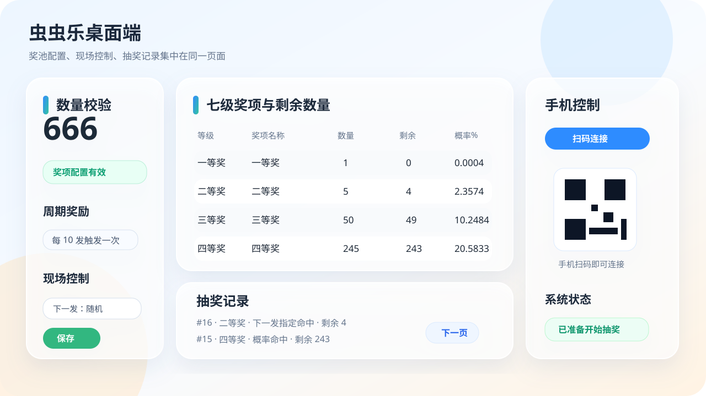
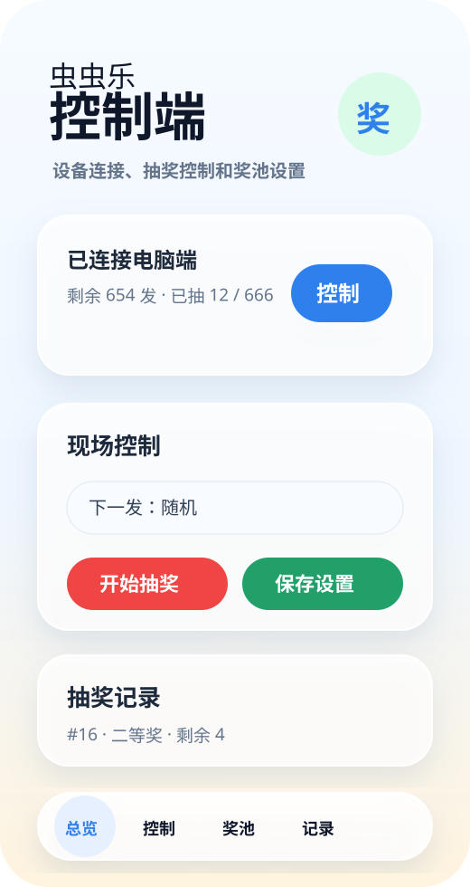
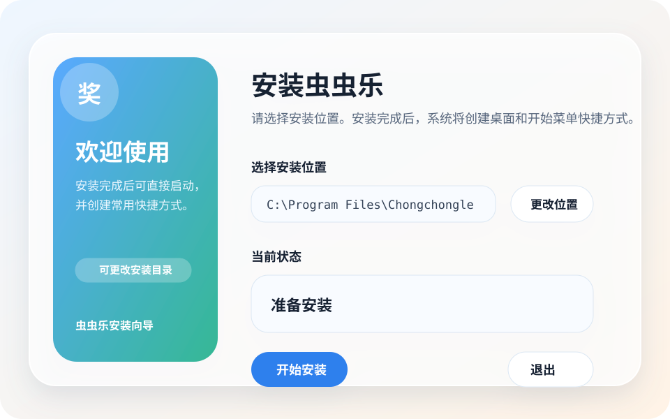

# 虫虫乐

虫虫乐是一套面向现场活动、门店互动、展会抽奖和小型运营活动的七级奖项抽奖控制系统。它由 Windows 桌面端、Android 控制端和手机网页控制端组成，适合在一台电脑上运行抽奖主程序，再用手机进行现场控制、奖池维护和记录查看。

## 主要功能

- 七级奖项管理：支持一等奖到七等奖的名称、数量、剩余数量、概率和图片配置。
- 概率校验：启用且有库存的奖项概率合计必须为 100%，减少现场配置错误。
- 下一发指定：可临时指定下一次抽奖结果，命中后自动恢复随机规则。
- 周期奖励：支持每隔指定发数，从选定奖项池中随机发出一个奖励。
- 三端控制：Windows 桌面端、Android App、手机网页端可协同控制。
- 扫码连接：手机可通过电脑端二维码快速连接控制台。
- 抽奖记录：支持查看历史抽奖记录，并按页数切换。
- 覆盖安装：Windows 安装包支持覆盖安装旧版本。

## 界面预览

| 桌面端奖池与记录 | 手机控制端 | 安装向导 |
| --- | --- | --- |
|  |  |  |

## 下载

请在 GitHub Releases 页面下载正式版本：

https://github.com/liwezee/chongchongle/releases

每个版本通常包含：

- Windows 安装包：用于电脑端抽奖主程序。
- Android APK：用于手机控制端。
- SHA256SUMS.txt：用于校验下载文件完整性。

## 使用方式

1. 在 Windows 电脑上安装并启动虫虫乐。
2. 在设置页配置奖项数量、概率、周期奖励和手机控制。
3. 在 Android 手机上安装控制端，或使用手机浏览器打开电脑端显示的控制地址。
4. 通过扫码或配对连接电脑端。
5. 在电脑端或手机端开始抽奖，并在抽奖记录中查看结果。

## 授权说明

本公开仓库仅用于发布正式安装包、APK、更新日志和校验信息，不再公开应用源代码。

虫虫乐新发布包采用专有软件许可。未经明确授权，禁止复制、二次分发、反编译、逆向工程、重新打包或绕过保护。

如需源码维护、构建或审计，请使用项目维护者的私有源码仓库。
